

# About

  

My name is Imsara Samarasinghe. I graduated with my MEng in Aeronautical Engineering from Imperial College London in 2024. During my time at university, I focused on the study of CFD and FE codes. I would like to further pursue this as a career in the future. I am currently looking for a role as a simulation engineer.

I have developed programming skills in Python, C++, Matlab and Fortran. I have written CFD codes that utilise MPI libraries to perform HPC-based fluid simulations. If you would like to see more of my projects download my CV in the link below.

[Download my CV](CV_Imsara_Samarasinghe.pdf)

---

# Master's Project
## Optimising 3D printed bone screws
This project implements a topology optimisation routine using the Finite Element Method (FEM) for a bone screw. The code leverages the Firedrake and IPOPT (via cyipopt) libraries to solve for the optimal material distribution of the screw material under a load, based on the Solid Isotropic Material with Penalization (SIMP) model. The output is the optimized material distribution and an animation of the optimization process.

The goal of this project was to design an internal structure for an orthopaedic screw that would prevent the bone-screw interface failure. The SIMP optimisation process produces a material distribution that reduces the shear stress concentration near the head of the screw, as this was reportedly the start of bone degradation. The resultant material distribution was also designed to be auxetic to prevent the screw from being pulled out due to shrinkage in tension.

  <a href="https://github.com/ImsaraSamarasinghe/Optimization-of-3D-Printed-Bone-Screws" target="_blank">
    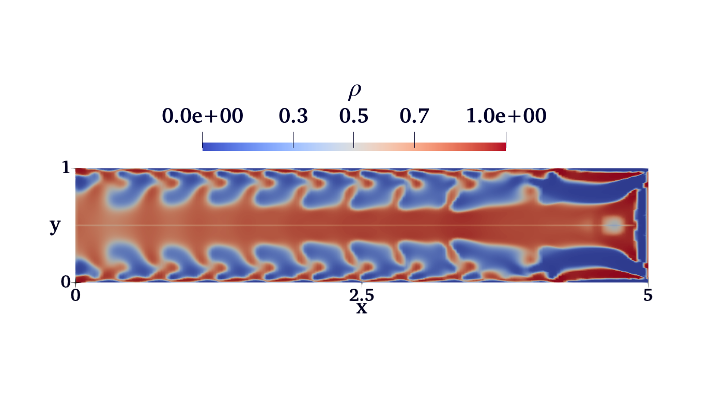
  </a>

---

# Coding Projects
## MPI Parallelised Lid Driven Cavity Flow
This project was undertaken as part of the 4th year HPC module. In this project, I used the MPI library and its functions to parallelise an existing C++ code. The project involved breaking the simulation domain into sevral subdomains. These subdomains were split among several processors and then functions such as `MPI_Send()` and `MPI_Recv()` were used for communication between processors. This was essential to facilitate the centred finite difference calculations at border nodes.

  <a href="https://github.com/ImsaraSamarasinghe/Lid-Driven-Cavity-Flow" target="_blank">
    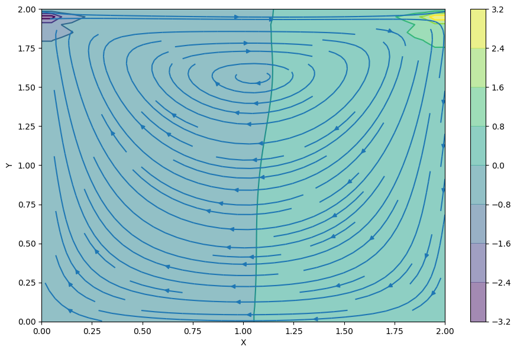
  </a>

## 2D FDTD simulation of Maxwell's Equations
This project simulates the propagation of an electromagnetic wave in 2D using the finite-difference time-domain (FDTD) method. It visualizes the evolution of the electric field over time in a grid, which is updated dynamically and saved as an animation. I created this project to learn how the leapfrog scheme is utilised to perform simulations of electromagnetic waves

  

## 2D Physics engine for multi-bodies
I created this code in Python using the Pygame library to develop my skills in Python programming and learn game development skills. I also wanted the oppurtunity to learn more about collision mechanics and how they are implemented.

  <a href="https://github.com/ImsaraSamarasinghe/Python-physics-engine" target="_blank">
    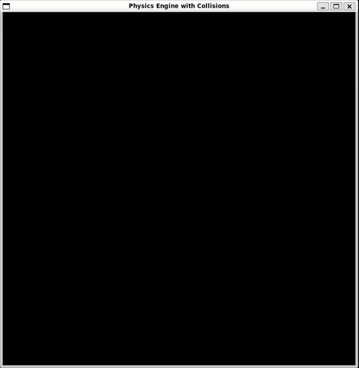
  </a>

## Agent based model for Viral Spread
I wrote this Matlab code as part of my first-year Computing and Numerical Methods assignment. I learnt how to create agent-based models, as well as implement fast and efficient array operations in Matlab. I scored a 22.5/25 for this project.

  <a href="https://github.com/ImsaraSamarasinghe/Agent-Based-model-for-Disease-Spread" target="_blank">
    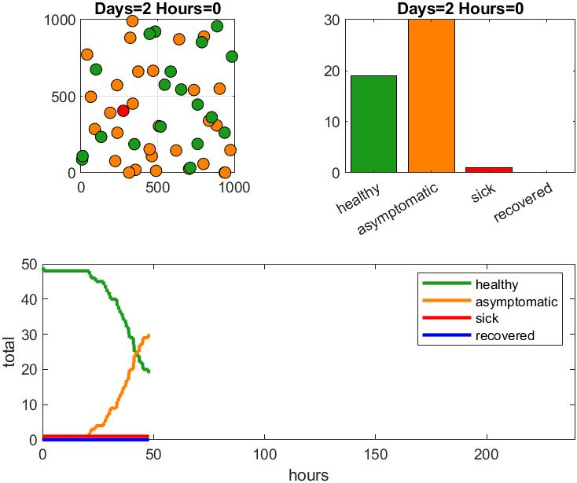
  </a>

## Agent based Schelling segregation model

  

---

# Engineering Projects
## Simulation of aerofoil cross section using Xfoil and Star-ccm+

    

        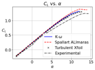
        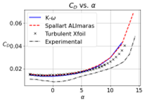
    

    

        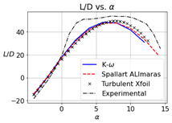
    

## High fidelity Simulation of aerofoil cross section in Nektar++

    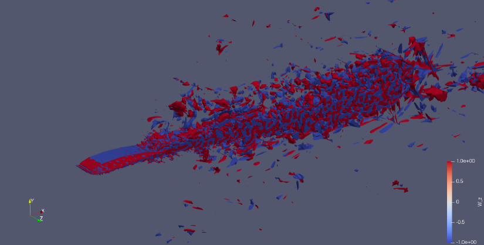

## Finite element simulation of wing box torsion using Abaqus

    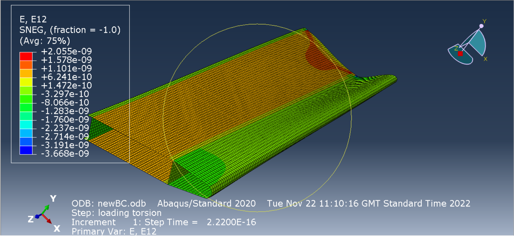

## Structural design of deployable re-entry vehicles and actuator sizing using SimScape

    

    

## PID controller design for a duo copter

    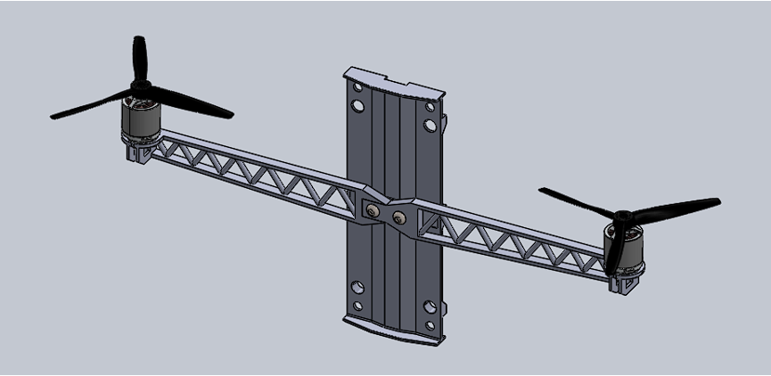

## Wing box design for conceptual aircraft

    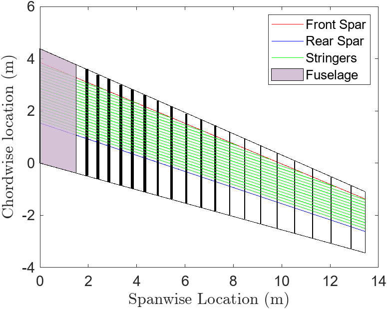

---
